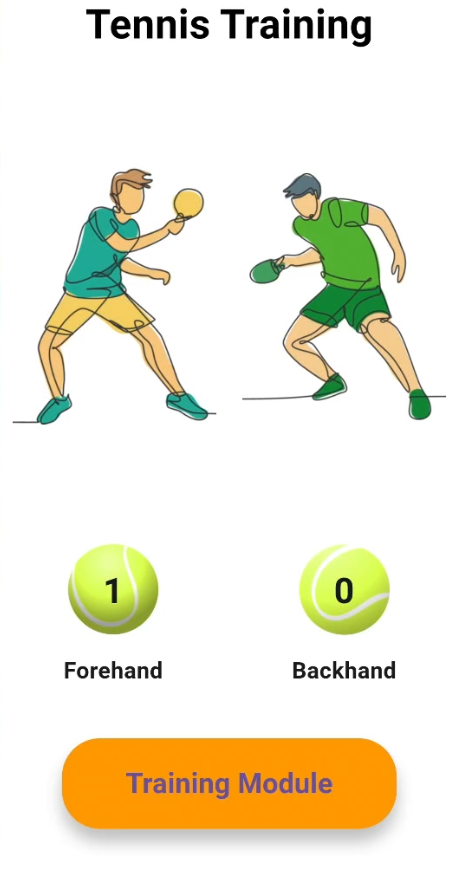
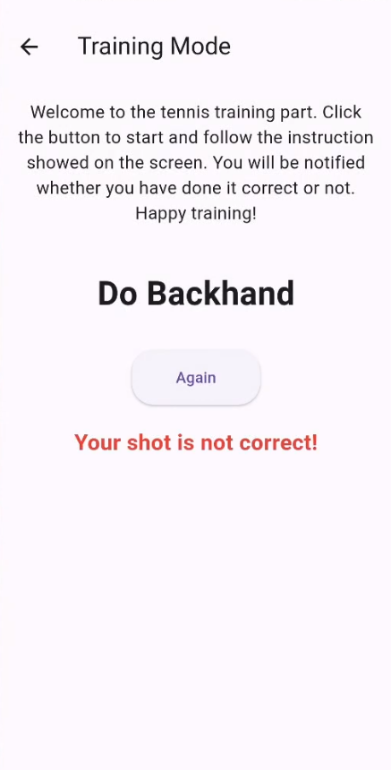

# Tennis Trainer - BLE + TinyML Motion Classification App

## Project Overview
This project leverages the **Arduino Nano 33 BLE Sense** board to collect **accelerometer** data, classify motion using **TinyML**, and display the classification results on a **Flutter-based mobile application** via **Bluetooth Low Energy (BLE)**.

The system is designed to detect and classify **two types of tennis strokes**:
- **Forehand**
- **Backhand**

In addition to live motion detection, the app features a **Training Module**, where users are given randomized instructions (either "Do Forehand" or "Do Backhand") and receive real-time feedback on their performance.

---

## Features
- **BLE Communication:** Real-time data transfer between Arduino Nano 33 BLE and the mobile app.
- **Motion Classification:** TinyML model running on the Arduino classifies user hand movements.
- **Flutter Mobile Application:**
   - Displays counters for detected Forehand and Backhand shots.
   - Includes a **Training Mode** to guide and evaluate user shots.
- **User-Friendly Interface:** Simple, responsive design with easy navigation and visual feedback.
- **Custom BLE Characteristics:** Separate BLE services for results and commands to enable two-way communication.

---

## Technologies Used
- **Hardware:** Arduino Nano 33 BLE Sense
- **ML Framework:** TensorFlow Lite for Microcontrollers (TinyML)
- **Mobile Development:** Flutter & Dart
- **BLE Library:** `flutter_blue_plus`

---

## Screenshots

### Home Screen:

### Training Mode:

